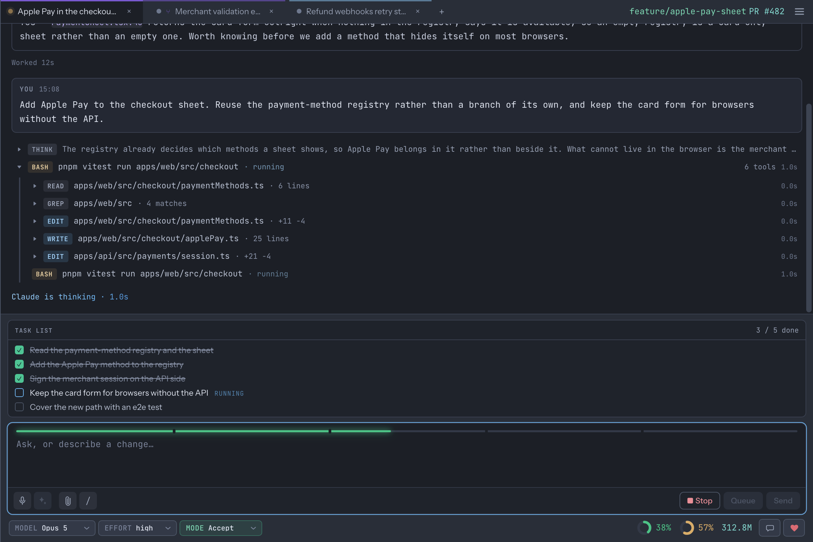

# Amazing Claude Code GUI

A Claude Code panel for JetBrains IDEs: a real chat with an input field and parsed
output, instead of a terminal session. The button lives on the side bar and can be
moved to any edge of the window.



🌐 What the plugin is, in your language:
[English](docs/marketplace/en.md) |
[简体中文](docs/marketplace/zh.md) |
[Русский](docs/marketplace/ru.md) |
[Español](docs/marketplace/es.md) |
[Português (Brasil)](docs/marketplace/pt.md) |
[Deutsch](docs/marketplace/de.md) |
[Français](docs/marketplace/fr.md) |
[日本語](docs/marketplace/ja.md) |
[한국어](docs/marketplace/ko.md)

The rest of this file is for people working on the plugin rather than using it.
The interface is built from the "Claude Code Panel" mockup in Claude Design.

## What it does that a terminal doesn't

Same agent, same account, same rules - but you point at files instead of typing paths,
see what it is doing instead of guessing, and answer it without leaving the IDE. Runs in
every JetBrains IDE from 2026.1 on, **Android Studio included**.

- **Point at files, don't type them.** Drag one in, type `@` to pick it, paste a
  screenshot - each lands as a chip you cannot mistype.
- **Send code with its address.** Select lines, "Send to Amazing Claude Code GUI", and the
  agent reads the real file around them: `@src/useSocket.js (L12:5-L18:30)`, not a snippet
  with no context.
- **Grab any part of an answer.** Quote it into your next message, or fork the
  conversation from that exact point - the original stays as it was.
- **A long paste folds into one chip** as you paste it, and opens back up in the message
  you sent.
- **See what it is doing.** Tool calls with their duration, diffs with counts, the todo
  list ticking off, plans, subagents, whole fleets of agents in one workflow call, and
  what the turn cost.
- **No unexplained silence.** An overloaded or rate-limited API becomes a card with the
  reason, the attempt and the countdown; a used-up limit says which window and when it
  resets.
- **Nothing answers for you.** A permission request, a plan or a question waits as long as
  it takes - no timeout, no auto-continue.
- **A side panel, not an editor tab**, on any edge of the window.
- **Conversations outlive the panel.** Collapse it, switch projects, come back - the agent
  kept working, and queued messages are still queued.
- **Model, effort and mode change mid-conversation**, per tab, without restarting
  anything.
- **The keyboard answers**: numbers pick an option, Shift+Tab cycles the mode, Escape
  stops the turn.
- **Your unsaved buffers** are written before a turn, and files the agent changed are
  re-read at once.
- **`!` runs a command in your own shell**, chips and all; the output travels with your
  next message, costing no turn and no permission prompt.
- **Answer it from your phone** - off by default, paired by QR code, end to end encrypted,
  revocable in one tap.

## Privacy and transparency

The short version, in full in [PRIVACY.md](PRIVACY.md):

- **The agent runs on your machine.** The plugin spawns the Claude Code CLI and reads its
  output. No proxy in between and no server of ours your conversation passes through. Your
  Claude sign-in belongs to the CLI: the plugin never reads it, copies it, or goes looking
  for API keys anywhere on the machine.
- **No telemetry.** No analytics, no usage reporting, no account. With remote access off,
  the only thing that ever leaves the machine is a feedback report you write and send
  yourself.
- **Your permission rules stay yours.** What is worth asking about is decided by the CLI -
  your settings, your allow and deny rules, your hooks - exactly as in the terminal. The
  plugin adds no hook of its own (it used to; see "Permissions" below), and it never starts
  a session in a laxer mode than the one shown under the input field.
- **Questions have no deadline.** No timer, no auto-answer: the turn stands still until a
  human decides. See "Permissions".
- **Remote access is off** until you turn it on, and even then the relay carries sealed
  envelopes it cannot read - see "Remote access from your phone".
- **The feedback report is built from a whitelist,** not copied out of your conversation,
  and one button shows the exact text that will travel - see "Telling the author
  something".
- **Source available** under the Elastic License 2.0: everything above can be checked
  rather than believed.

## How it's built

Three layers, each with its own responsibility:

- **Kotlin shell** (`src/main/kotlin`) - registers the panel, hosts the embedded
  browser, spawns `claude` processes (one per conversation), and parses their event
  stream line by line. It has no idea what that stream looks like on screen.
- **React interface** (`webview/`) - everything the user sees. Receives agent
  events untouched and decides on its own what to turn them into.
- **Bridge** - `window.__accSend` from the web to the shell, `window.__accReceive`
  back. The message format is described in `webview/src/protocol.ts`, the single
  source of truth for the Claude Code stream.

The built static assets are bundled into the plugin archive and served to the
browser through a custom scheme handler: it needs a real address, otherwise module
scripts don't work. The mockup's fonts ship alongside it - the panel never goes to
the network for typography.

## What the panel already renders from the live stream

The feed turns agent events into the mockup's cards: messages, formatted replies,
tool calls with duration and expansion, edit diffs, todo lists, plans, questions
with options, subagents, context compaction, and turn summaries with cost.

The bottom line is the same summary as a terminal status line: the branch and its
pull request, context usage, the five-hour and weekly subscription windows (the
second figure is a separate model's window), and the amount of work in tokens.

Below it: model, effort, and permission mode. The choice is made once - it's
inherited by new tabs and forks and survives an IDE restart, because it lives in
the editor's settings rather than the panel's memory. A new conversation starts
with it right away, as process flags; a live one gets it via a slash command.

The composer supports a drag-and-drop queue, quotes from selected text, and
attachments through the IDE's own dialog - one button for files, folders, and
images at once. Slash commands are suggested right in the input field, just like
in the terminal: the list narrows as you type, and arrows plus ⏎ pick an item.

Everything that isn't typed text lives in the field as a chip: a file, a folder,
an image, a quote, a command - and a multi-line paste, which collapses into one so
a pasted log doesn't push the rest of the message out of sight (one click expands
it back into plain text). Chips are indivisible, so the caret doesn't step over
them: it stops on one and highlights it, Backspace removes it, and the same arrow
again moves past.

A question from the agent and a permission request are answered from the keyboard
too: their options are numbered, and the number keys pick them - as long as the
input is empty, so a message that starts with a digit still types one.

The list has three sources. Project commands come from the agent itself - the
panel doesn't invent its own. Built-in ones (`/model`, `/effort`, `/context`,
`/cost`, `/usage`) were checked against a live agent: not all of them work in
streaming mode, `/clear`, `/compact`, and `/export` are interactive there and
refuse, so they're not in the list. The panel's own commands run locally and
aren't sent to the agent: `/resume`, `/fork`, `/login`, and `/logout`.

## A piece of code from the editor

"Send to Amazing Claude Code GUI" in the editor's context menu puts a reference to the
selection into the input field - `@src/useSocket.js (L12:5-L18:30)` - not the text
itself. That distinction matters: from the reference, the agent reads the whole
file and sees what's around it. Columns only appear when the selection cuts across
a line; whole lines keep just their numbers, and with no selection at all the
reference points at the line under the caret.

## Login

The panel checks login status at startup and, until it's done, shows neither the
input field nor the extra buttons - only a login button. The reason is simple:
without login, the agent answers any question with a line about `/login`, and
that command itself isn't available in streaming mode.

Login happens in the IDE's built-in terminal: `claude auth login` opens a browser
and waits for the redirect back. The panel asks the CLI itself and closes the
login screen as soon as it succeeds. If login drops later, the panel notices it in
the agent's response and returns to the same screen.

## Forks

Select a piece of a reply - "Fork from here" (or ⌥B) appears right above the
selection. The panel branches the conversation: the agent gets the whole
transcript up to that point but continues in a new one, while the original stays
exactly as it was, no matter what you ask in the fork.

The fork opens as a tab with a normal input field, and the selected text travels
with it as a quote above the field - no need to edit it, and it doesn't clutter
the field itself. The `/fork` command does the same thing without a selection -
it just continues the conversation from that point in a new tab.

The dot on a tab tells you what's going on there: gray - idle, breathing yellow -
the agent is working, green - the turn is done, blue - waiting on you (a question
or a permission request).

Forks live as a group: a conversation and all its branches share one colored bar,
their tabs sit next to each other, and nesting is shown by indentation and a
branch mark. A fork of a fork stays in the same group - it's one thread, no reason
for it to scatter across the tab bar.

## Conversation history

The "History" button in the header (and the `/resume` command) opens this
project's past conversations. The list is kept by Claude Code itself - one file
per conversation in its own folder - so it also shows conversations that started
in the terminal. Picking one opens a tab: the process starts with its transcript,
and the panel replays the saved events into the feed, otherwise the tab would look
empty despite the agent remembering everything.

The folder is found by the CLI's own rule: the project path with every character
that isn't a letter or a digit turned into a dash. Both the path the IDE reports
and its resolved form are checked, since a project can sit behind a symlink and
the CLI files conversations under the real path.

This can't be done with its own slash command: in streaming mode, `/resume` opens
an interactive list and refuses instead.

## Shell commands

A message starting with `!` isn't a message at all - it's a command, the same
bash mode the Claude Code terminal has: `!git status`, `!pnpm test`. The panel
runs it itself, through your own login shell and in the project directory, so it
sees the same `PATH` and the same profile the terminal next to it does. The field
turns amber and the Send button becomes Run, so it's clear before the keypress
that this goes somewhere else than the agent.

The output lands as a card in the feed, on its own place in time, and travels to
the agent attached to your next message, wrapped in the same `<bash-input>` /
`<bash-stdout>` tags Claude Code uses. That's the point of the mode: looking
something up costs no turn of the agent and no permission prompt, but the agent
still sees what you saw.

Two things follow from the panel not being a terminal. There's no input, so it is
closed straight away - anything that asks a question (`git commit` without a
message, `npm login`) gets end-of-file and finishes instead of hanging. And there
is a two-minute limit, after which the command is killed and says so, keeping
whatever it managed to print.

Chips inside a command expand to their value - drag a file in and its path lands
in the command - and always as a single argument: quoting is added when the value
needs it, so a path with a space stays one argument and a file name with a
semicolon in it can't tack a second command onto the line.

## Sound alerts

The panel calls you out loud when it stops needing the keyboard and starts
needing you: a turn that finished, a tool call waiting for approval, a question,
a plan asking to be accepted, a subscription limit that stopped the turn, the
moment an exhausted limit turns into extra usage and the work starts being billed
on top of the plan, and trouble (an error, a process that died on its own, a
session that got signed out). The "♪" button in the header lists all seven with
a checkbox, a volume slider and a play button each. Zero volume unchecks the
sound - silence and "off" are the same thing - and a sound turned off keeps its
volume for when it comes back.

A sound only plays when you're not already looking at what it's about. Anything
from a background tab always rings; from the tab that's open it rings only when
looking at it isn't possible - the panel is collapsed, hidden behind another
tool window, or the IDE window itself is not the one you're in. A conversation
replayed from history stays quiet too: its old questions and errors arrive as
the very same events a live turn does, and only the fact that no turn is running
tells them apart.

The sound itself is played by the plugin, not by the page: the embedded browser
renders offscreen and obeys the autoplay policy, so the first alert would never
be heard without a click. Which moments are worth a sound is decided by the panel
- that's the only side that knows a plan is waiting rather than being written.

## Running it

You'll need JDK 21, pnpm, and Claude Code installed (`claude` on your PATH).

For manual testing there's a separate `ACC Sandbox` app (in `~/Applications`,
usually pinned to the dock). It builds the plugin and launches a second copy of
WebStorm with its own settings, opening `sandbox-project` - your main window is
left untouched. Running it again kills the previous copy first, so "fix it, then
relaunch" is a single click. The app is a thin wrapper around
`scripts/sandbox.sh`; the build log lives in `build/sandbox.log`.

```bash
# the same thing from a terminal
./gradlew runIde

# same, but the interface loads from the dev server: edits show up without rebuilding the plugin
cd webview && pnpm dev          # in a separate terminal
./gradlew runIde -PwebviewDevUrl=http://localhost:5173
```

The panel opens on its own in the test IDE. Browser dev tools are `⌘⇧D` inside the
panel.

## Testing

```bash
./gradlew test            # stream parsing and output line joining
cd webview && pnpm test   # feed building against a recorded live stream
./gradlew buildPlugin     # archive in build/distributions
```

Tests run against `webview/src/__fixtures__/stream.ndjson` - a real stream from a
live agent run, not made-up events.

## Permissions

The panel asks for real, and it asks exactly when the terminal would. The agent
run in streaming mode raises a `can_use_tool` request over the control channel,
the panel shows a card, and the turn stands still until a human clicks a button.

Deciding *what* is worth asking about is the CLI's job, not ours: it applies the
current mode, the allow and deny rules from every settings layer, and its own list
of harmless commands. Reads and searches go through untouched; commands, writes,
network access, and MCP tools reach the card.

The panel used to add a `PreToolUse` hook of its own on top of that. A hook runs
before any of the CLI's own permission checks, so it asked about everything -
about `ls` and `git status`, about calls already covered by a rule, and in the
very modes that promise no questions at all ("Don't ask", "Auto", "Bypass"). It's
gone; the channel alone is the path.

"Always allow" is answered on the same request, with the rule the CLI itself
suggests for that call. The CLI applies it to the live session immediately and
writes it into the project's local settings, so it survives a restart and holds in
the terminal too.

## Control channel

Besides regular messages, the same stream carries control traffic with the
process. The panel uses it for three things:

- **Changing the permission mode on the fly.** There's no slash command for this,
  and the flag is only read at startup, but a control message is applied by the
  agent to the very next tool calls. In the panel that's Shift+Tab over the first
  three modes, just like in the terminal. The button and menu show the mode that
  was actually applied, not just picked: if the agent refuses, the panel falls
  back to the previous one and shows the reason in the feed - for example, "auto"
  isn't available to every model, Haiku simply doesn't have it. A mode picked
  before the first turn isn't lost either: it goes out as a process flag at
  startup.
- **Asking for usage.** The response is a structure: the five-hour and weekly
  window shares, their reset time, and the current model's context window size.
  The last one matters: large models have a million-token window, and without it
  the gauge would understate usage threefold.
- **Interrupting a turn.** The stop button used to kill the whole process along
  with the conversation; now it only interrupts the current reply.

Usage shares aren't in the event stream itself, and the regular status line isn't
invoked in non-interactive mode - both were checked before settling on this path.

## Remote access from your phone

Off by default. When you turn it on, a paired phone can read your conversations and answer them - the
point being the one moment a phone is genuinely better than a laptop: the agent has stopped on a
permission and you are not at your desk.

Three steps: turn it on in the panel's menu (**Remote access**), scan the QR code with your phone,
confirm the pairing in the IDE. The confirmation shows a fingerprint - compare it with the one your
phone shows, which catches the one case the cryptography cannot: somebody who photographed your
screen and scanned it first.

**What a phone may do:** read the feed, send messages, answer permissions, approve or send back plans,
answer questions, stop a turn, open a new conversation.

**What it may not:** run shell commands, install plugins or MCP servers, change the permission mode,
change the path to the executable, touch your clipboard, open files or links on your machine, or pair
and revoke devices. That list is enforced on your machine, and anything not on it - including kinds of
message that do not exist yet - is refused rather than passed through.

Approving a plan from the phone is the one exception worth knowing: it puts that conversation into
"accept edits" rather than the full no-questions mode the same button uses at your desk. File edits go
ahead, while shell commands and network access still ask - and those you can answer from the phone.

**What the relay can see:** two random addresses, message sizes and times, your IP. Not the contents -
those are sealed between your IDE and your phone, and the relay has no code that could read them. It
does see when you are connected and how much is moving, which is roughly your working hours. The
relay's source is public and you can point the plugin at your own copy; see `PRIVACY.md` and the
relay's README.

**Revoking** a device takes effect immediately and works while the phone is switched off: the IDE
forgets its key, and from that moment nothing from it can be opened.

Notes on platforms: on iOS notifications work only for the app added to the home screen, and only on
iOS 16.4 or newer. On Android the ordinary browser is enough.

## Telling the author something

The speech bubble beside the heart opens a form: a bug, an idea, or nothing in particular, with an
optional address to answer to, up to ten files, and a debug report attached unless you switch it off.
The same screen is in the menu, as **Send feedback**.

The report is technical only - the plugin's version, the IDE and its build, the operating system, the
version of Claude Code, and an outline of what the open tab did: which tool ran, how many bytes went in
and came back, what failed and when. No messages, no answers, no file contents, no commands, no paths,
no project name; file names appear as short hashes, so the same file reads as the same file without
saying which one. The screen names the tab it describes, and **see exactly what gets attached** shows
the whole string that will travel - there is no fuller version kept back for the wire.

It goes to a small service beside the relay (`feedback-service/` in this repository), which forwards it
to the author's Telegram and stores nothing. This is the one thing the plugin sends without remote
access being on, and only ever on a press of Send; `PRIVACY.md` has the whole account of it.

## What's missing so far

- **A light theme.** The mockup describes one dark scheme only; in a light IDE the
  panel stays dark.

## Logo and icons

The master file is `src/main/resources/META-INF/pluginIcon.svg`. The plate - the
pale frame and the coral field inside it - is traced from the original raster,
which is why those two paths are long and are rebuilt rather than edited. The ACC
monogram standing on it is drawn, in the same cream the old mark had, so it holds
its shape at every size.
The marketplace only accepts a vector logo, on a 40x40 canvas with the mark itself
fit into 36x36 so a margin is left around the edge. `assets/logo.png` and
`assets/logo-512.png` are rasters of that same file, for the places that cannot
take a vector.

The side bar button is `src/main/resources/icons/toolWindow.svg` and its dark
counterpart. It carries the same monogram in the same strokes - the logo without
its background - because the platform wants two separate files rather than one
shared drawing. The stroke colors (`#6C707E` and `#CED0D6`) are set by the
platform: it relies on them for contrast when it highlights the active button.

The phone client's icons are generated from the logo, never drawn by hand:

```
python3 scripts/mobile-icons.py
```

## Publishing

The archive is uploaded by hand the first time; Gradle handles everything after
that.

```bash
./gradlew buildPlugin    # archive in build/distributions
./gradlew verifyPlugin   # the same verifier moderation runs
```

Next is the "Upload plugin" form on the
[marketplace](https://plugins.jetbrains.com/plugin/add), under your own JetBrains
account. The plugin goes through manual moderation, usually answered within three
to four business days.

Once approved, updates ship with a single command:

```bash
export ACC_PUBLISH_TOKEN=...   # plugins.jetbrains.com/author/me/tokens
./gradlew publishPlugin
```

Signing the archive is optional, but with it the IDE can show the user that the
archive wasn't tampered with along the way. The build takes the key and
certificate chain from the environment - `ACC_PRIVATE_KEY`,
`ACC_CERTIFICATE_CHAIN`, `ACC_PRIVATE_KEY_PASSWORD`. Without them, the signing
task is simply skipped.

The release channel comes from the version: `0.2.0` ships to everyone, `0.2.0-beta.1`
goes to the `beta` channel, which a user subscribes to manually in their plugin
repository settings.

What moderation checks besides the code: the name is under 30 characters and
doesn't contain "Plugin", "IntelliJ", or JetBrains product names; the description
is in English; the author has a working website and email; the logo is original
and doesn't resemble JetBrains' own logos; no third-party trademarks are used
without the owner's permission.

## License

Source-available under the [Elastic License 2.0](LICENSE). You can read, use,
modify, and redistribute the code. You can't offer it to others as a hosted or
managed service, and you can't strip out the license, copyright, or authorship
notices.

The name, the logo, and the plugin ID are not part of that license: a fork ships
under its own name and its own ID. See [TRADEMARK.md](TRADEMARK.md).
